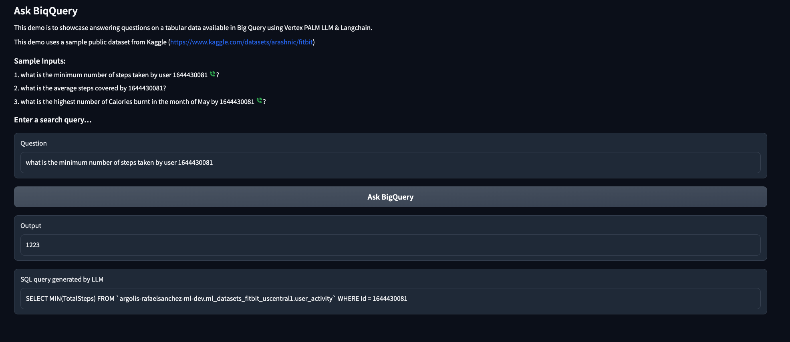

# Generative AI Labs

This repository contains code samples for **Generative AI**, including different use cases. 
Some examples can be executed in Colab, while others would require Vertex AI.

Setup and authentication instructions of Vertex SDK are available [here](https://cloud.google.com/vertex-ai/docs/start/client-libraries). Make sure you install [latest version of the Vertex SDK](https://pypi.org/project/google-cloud-aiplatform/): `pip install google-cloud-aiplatform --upgrade`. Other dependencies may be required. Those are indicated in the code.


## 01 Prompting

* Lab 01-1: [Chain-of-Thought](01-prompting/01-1-cot.ipynb)
* Lab 01-2: [External tools (RAG)](01-prompting/01-2-external-tools.ipynb) 
* Lab 01-3: [ReAct](01-prompting/01-3-react.ipynb)
* Lab 01-4: [LangChain intro](01-prompting/01-4-langchain.ipynb)
* Lab 01-5: [LangChain 0.1.0 with ReAct and agents](01-prompting/01-5-langchain-react-agents.ipynb)
* Lab 01-6: [Pandas AI](01-prompting/01-6-pandasai.ipynb)
* LangChain specific labs. [LangChain](https://python.langchain.com/docs/get_started/introduction.html) is an open-source tool that can orchestrate or integrate APIs (databases, documents, apps, ...) with LLMs. LangChain is **not** a tool for tuning models.
* Ask Database labs: Ask BigQuery and [other databases](https://cloud.google.com/blog/products/data-analytics/building-ai-powered-apps-on-google-cloud-databases-using-pgvector-llms-and-langchain) in natural language.



Notes:
* [SQLAlchemy](https://www.sqlalchemy.org/) does not work  with `bigquery-public-data` datasets due to permissions, use a custom dataset instead.
* Make sure your query is not empty, otherwise you will get unexpected non-workable behaviour. You need to fill the input prompt.

```sh
pip install langchain==0.0.191 --quiet
pip install google-cloud-core --quiet
pip install gradio --quiet

# Below libraries are required to build a SQL engine for BigQuery and other DBs
pip install SQLAlchemy --quiet
pip install sqlalchemy-bigquery --quiet
pip install clickhouse-sqlalchemy --quiet
```


## 02 Tuning

* Lab 02-1: [Full-fine-tuning of T5-small with BillSum dataset](02-tuning/02-1-t5small-billsum.ipynb)
* Lab 02-2: [Comparison of quantization methods: NF4, GPTQ, GGUF, AWQ](02-tuning/02-2-gptq-gguf-awq.ipynb)
* Lab 02-3: [PEFT tuning of Phi-2 with DialogSum dataset](02-tuning/02-3-phi2-dialogsum-qlora.ipynb)
* Lab 02-4: [PEFT tuning of Mistral-7B with custom dataset](02-tuning/02-4-mistral-custom-qlora.ipynb)
* Lab 02-5: [RLHF of FLAN-T5 with PPO  to Generate Less-Toxic Summaries](02-tuning/02-5-rlhf-flant5-ppo.ipynb)


## 03 AI infra

* Lab 03-1: [TPU Xception with flowers dataset](03-ai-infra/03-1-tpu-xception-flowers.ipynb)
* Lab 03-2: [TPU BERT pre-training and fine-tuning with custom dataset](03-ai-infra/03-2-tpu-bert-custom.ipynb)
* Lab 03-3: [JAX intro](03-ai-infra/03-3-jax.ipynb)
* Lab 03-4: [KV cache](03-ai-infra/03-4-kvcache.ipynb)
* Lab 03-5: [Ray intro](03-ai-infra/03-5-ray-train.ipynb)
* Lab 03-6: [Ray tune](03-ai-infra/03-6-ray-tune.ipynb)

Tutorials Distributed Training:

1. Colab: [TensorFlow with GPU](https://colab.sandbox.google.com/notebooks/gpu.ipynb)
2. Keras tutorial: [Multi-GPU distributed training with TensorFlow](https://keras.io/guides/distributed_training_with_tensorflow/)
3. Keras tutorial: [Multi-GPU distributed training with JAX](https://keras.io/guides/distributed_training_with_jax/) 
4. Keras tutorial: [Distributed training with Keras 3 tutorial](https://keras.io/guides/distribution/) shows model distribution, as well as data distribution.


## 04 Multimodality

* Lab 04-1: [MNIST Deep Autoencoder](04-multimodal/04-1-intro-vae.ipynb)
* Lab 04-2: [Convolutional Variational Autoencoders](04-multimodal/04-2-convolutional-vae.ipynb)
* Lab 04-3: [Inference text-to-image](04-multimodal/04-3-inference-text2image.ipynb)
* Lab 04-4: [Denoising Diffusion Implicit Models](04-multimodal/04-4-ddim-potion.ipynb) 
* Lab 04-5: [GPT-4 for video and TTS API](04-multimodal/04-5-gpt4-with-vision-for-video-understanding.ipynb) 
* Lab 04-6: [LCM LoRA](04-multimodal/04-6-lcm-lora-inference.ipynb)
* Lab 04-7: [Hugging Face diffusers library](04-multimodal/04-7-huggingface-diffusers-intro.ipynb)


## 05 Retrieval Augmented Generation (RAG)

* Lab 05-1: [Ask large docs](https://medium.com/google-cloud/generative-ai-q-a-with-semantic-answering-on-large-scanned-documents-with-vertex-ai-chroma-7f4806a3cb71)
* Lab 05-2: [Ask small docs](https://github.com/rafaelsf80/genai-vertex-documents-synchronous)


## References

`[1]` SDK documentation: [Generative AI client libraries - Vertex AI](https://cloud.google.com/vertex-ai/docs/start/client-libraries)

`[2]` Google Cloud blog post: [Building AI-powered apps on Google Cloud databases using pgvector, LLMs and LangChain](https://cloud.google.com/blog/products/data-analytics/building-ai-powered-apps-on-google-cloud-databases-using-pgvector-llms-and-langchain)

`[3]` Towards Data Science article: [LangChain: Develop applications powered by Language Models](https://towardsdatascience.com/develop-applications-powered-by-language-models-with-langchain-d2f7a1d1ad1a)     
