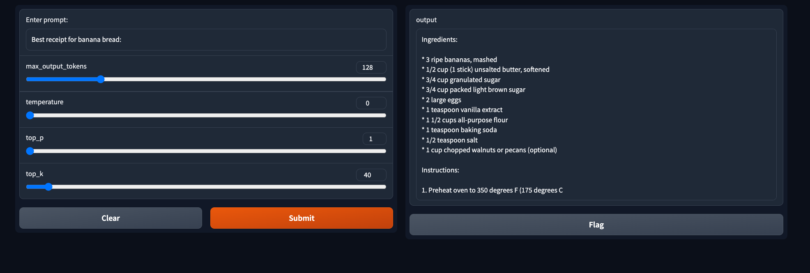
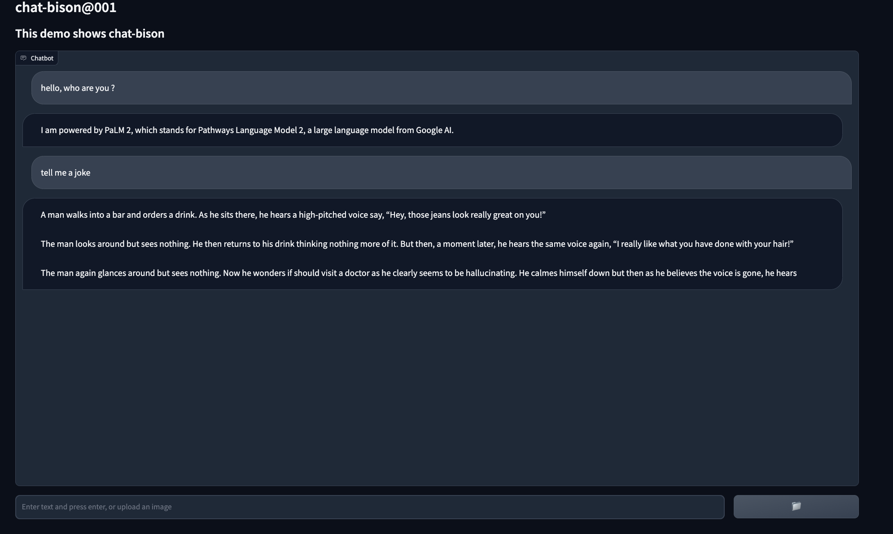
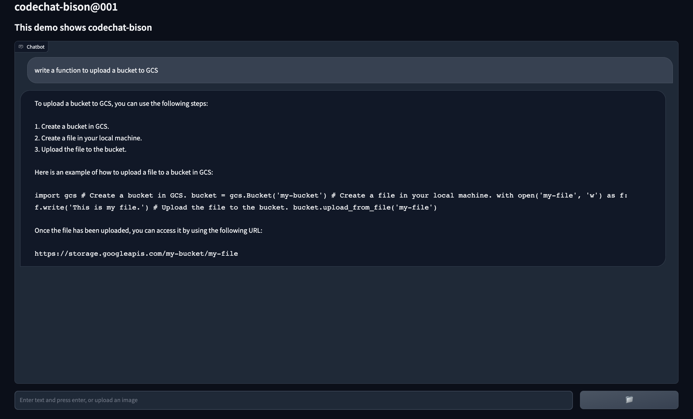
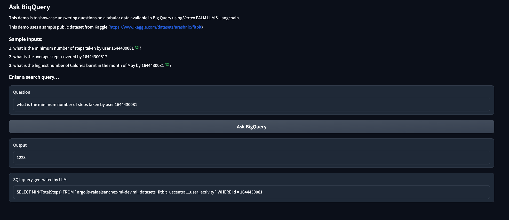

# Generative AI Labs

This repository contains code samples for **Generative AI** in Vertex AI, including different use cases. 
Setup and authentication instructions of Vertex SDK are available [here](https://cloud.google.com/vertex-ai/docs/start/client-libraries). Make sure you install [latest version of the Vertex SDK](https://pypi.org/project/google-cloud-aiplatform/): `pip install google-cloud-aiplatform --upgrade`. Other dependencies may be required. Please, complete those steps before trying any of the labs below.


## Lab 01: Text Generation models

`text-bison@001` demo in Gradio. 



Refer to this [Medium post](https://medium.com/google-cloud/generative-ai-palm-2-model-deployment-with-cloud-run-54e8a398b24b) for deployment of text generation models in Cloud Run.


## Lab 02: Chat generation models

`chat-bison@001` demo in Gradio.




## Lab 03: Embedding models

PENDING


## Lab 04: Code generation and completion models

`codechat-bison@001` demo in Gradio:



Demo script:
```sh
# Demo in Gradio or Generative AI Studio
1. "Generate Python code for a TensorFlow model to do classification using the MNIST dataset"
2. "Explain Adam optimizer and also suggest other optimizers"
```

Demo script with **Duet AI for Developers** in VS code:
```sh
# Demo in VS Code
1. write a fibonacci number (ALT+SPACE to generate)
2. write a funtion toc reate a bucket, with assert
3. write a function to upload a file
4. borrar una frase y ver cómo me la rellena de neuvo
5. chat: explain my code now propose a tes plan,, docusing on unit tests,  but write the response in spanish

# Demo in Cloud Shell
1. what is the gcloud command to create a vertex workbench instance with python3.7 ?

```


## Lab 06: LangChain and Vertex AI 

[LangChain](https://python.langchain.com/docs/get_started/introduction.html) is an open-source tool that can orchestrate or integrate APIs (databases, documents, apps, ...) with LLMs. 

LangChain is **not** a tool for tuning models.

References:    
https://towardsdatascience.com/develop-applications-powered-by-language-models-with-langchain-d2f7a1d1ad1a


## Lab 07: SentencePiece

[SentencePiece](https://github.com/google/sentencepiece) is an unsupervised text tokenizer and detokenizer mainly for Neural Network-based text generation systems where the vocabulary size is predetermined prior to the neural model training. SentencePiece implements **subword units** (example, byte-pair-encoding (BPE) fom [Sennrich et al](https://aclanthology.org/P16-1162/)) and unigram language model, from [Kudo](https://arxiv.org/abs/1804.10959)) with the extension of direct training from raw sentences. 


## Lab 10: Ask Database

Ask BigQuery and [other databases](https://cloud.google.com/blog/products/data-analytics/building-ai-powered-apps-on-google-cloud-databases-using-pgvector-llms-and-langchain) in natural language.



Notes:
* [SQLAlchemy](https://www.sqlalchemy.org/) does not work  with `bigquery-public-data` datasets due to permissions, use a custom dataset instead.
* Make sure your query is not empty, otherwise you will get unexpected non-workable behaviour. You need to fill the input prompt.

```sh
pip install langchain==0.0.191 --quiet
pip install google-cloud-core --quiet
pip install gradio --quiet

# Below libraries are required to build a SQL engine for BigQuery and other DBs
pip install SQLAlchemy --quiet
pip install sqlalchemy-bigquery --quiet
pip install clickhouse-sqlalchemy --quiet
```


## References

`[1]` SDK documentation: [Generative AI client libraries](https://cloud.google.com/vertex-ai/docs/start/client-libraries)

`[2]` Public documentation: [Generative AI Studio](https://cloud.google.com/vertex-ai/docs/start/studio)

`[3]` Github repo: [Q&A on unstructured documents with Vertex AI LLM and Document AI OCR](https://github.com/rafaelsf80/genai-vertex-documents-synchronous)

`[4]` Medium post: [Generative AI — Q&A with semantic answering on large scanned documents with Vertex AI, Chroma, LangChain and Document AI OCR](https://medium.com/google-cloud/generative-ai-q-a-with-semantic-answering-on-large-scanned-documents-with-vertex-ai-chroma-7f4806a3cb71) 

`[5]` Google Cloud blog post: [Building AI-powered apps on Google Cloud databases using pgvector, LLMs and LangChain](https://cloud.google.com/blog/products/data-analytics/building-ai-powered-apps-on-google-cloud-databases-using-pgvector-llms-and-langchain)